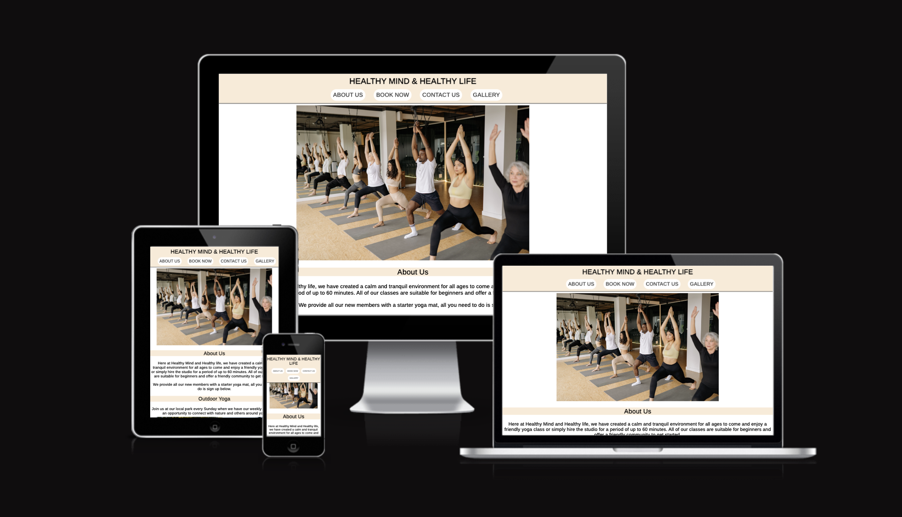
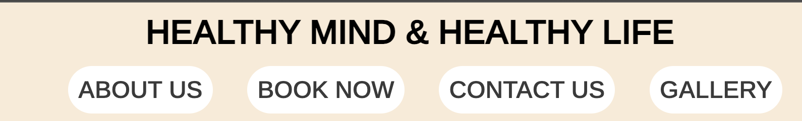
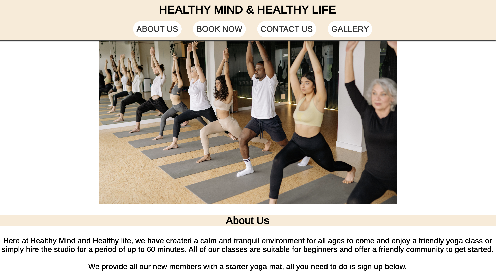
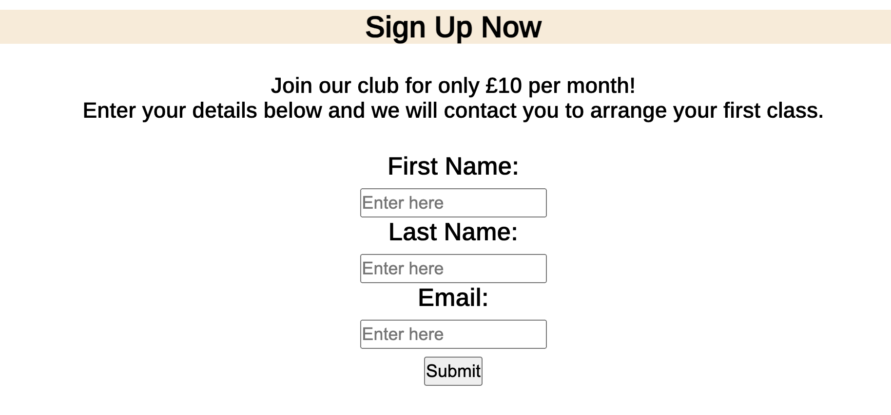
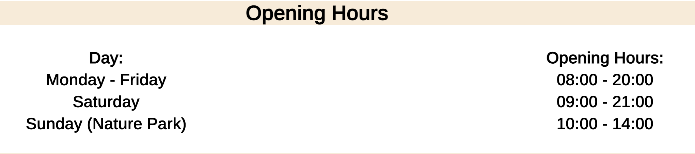
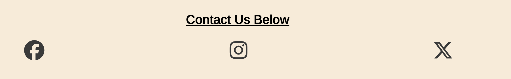
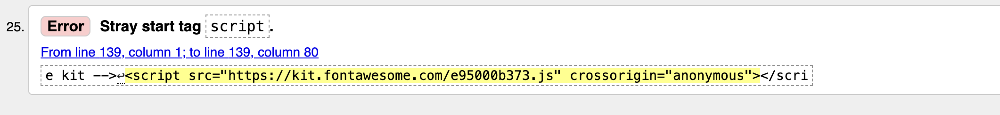
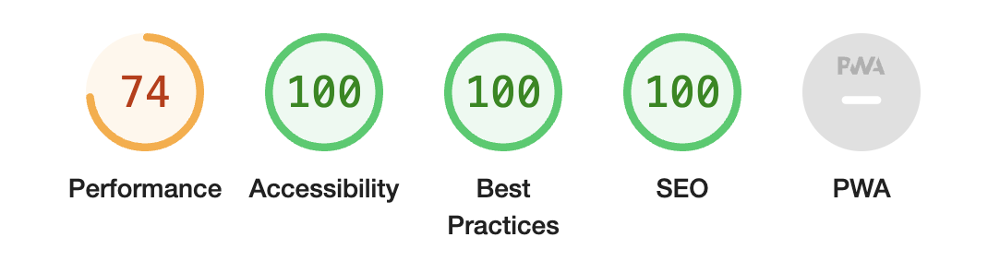

# Healthy Mind & Healthy Life

Healthy Mind & Healthy Life is a website that was created for people out there who find it intimidating trying new hobbies, specifically yoga. The aim of Healthy Mind & Healthy Life is to provide a safe and beginner friendly environment for anyone wanting to get into yoga. Offering a lower price and starter equipment allows the website to cater towards all audiences.

The website is fully respsonive and was designed using HTML and CSS.

[View the live site](https://cal009.github.io/healthy-mind-healthy-life/)

## Features

### Favicon

* The icon for my website was created to give the website a cosy feel whilst keeping it simple.
* The background of the icon matches similarly to the main colour of the website.

### Navigation

* The navigation bar is located at the top of the page and will remain at the top of the page even when scrolling through the website.
* It has the company name centered in the navigation bar followed by page links to other areas in the website.
* The first three links will remain on the same HTML page however the fourth link will take you to an external html page specifially designed for the gallery.
* The nav bar also changes when going to the gallery link as it no longer needs the four links.
* It is in a font and colour that is easily readable and maintains the same font and colour through the website.

### About Us

* About us details the main objectve of the company, offering a beginner friendly service to new comers to yoga.
* The design was simple and short, this prevents an overload of information. This will make it more appealing to a beginner not knowing much about the hobby.
* The text is readable and has a clear contrast with the background, the colours chosen are soft and pleasing to the eye, fitting in with the company's goals.
* A large image centered draws the eye staright there,then followed by the text which catches the viewers attention.

### Outdoor Yoga

* I created this section as a small insight into what we can offer, and that it's out of the ordinary. It makes it stand out against other competitors.
* I have also included a large image showcasing what it looks like and how many people join in. The aim of this is to prevent the thought of being the only one there.

### Sign Up Form

* This section was kept simple to avoid confusion when trying to sign up, clearing stating the cost.
* Furthermore the form will allow for someone to contact you to arrange the appointment and answer any questions you might have.
* The sign up form will not allow the user to submit without filling out all the fields and correctly inputting a valid email.

### Opening Hours

* The Opening hours table was made to allow the user to easily identify when the classes are available. This can make for a better user experience as they can plan around their schedule.
* It also includes the time and day of the Nature park yoga incase that is their main interest.

### Contact us

* I kept the design the same as the rest of the website, maintaining the same colours and font.
* I added in some social media links which allow for direct links to Facebook, Instagram and X-twitter. These open in a new tab allowing the main website to remain open.

## Testing

* I tested to make sure this page works well on both Chrome and Safari
* I ensured the page was responsive, looking good on all screen sizes using the dev tools.
* I tested to make sure all the navigation buttons work as intended.
* I ensured that the form works as intended, being unabee to submit without correct details.

## Validator Testing

* After running my code through the W3C validator it came up with one error, after researching the error it was due to a missing start tag, or the programme being unable to find the start tag. After checking the code myself i could see the start tag for the elemnt in the rgght spot as specified by the website when I copied the code. The code was from google fonts.

* I had no errors when passing it through the official (Jigsaw) validator
* I confirmed that the colors and fonts are easy to read and accessible. I ran this through the lighthouse dev tool.

## Bugs

### Solved Bugs

* Had an issue with my navigation bar when testing through W3C stating that I couldn't have an 'a href' inside of a button. As a result I changed the section to a list rather than a button and this solved the issue.

### Unsolved Bugs

* I have an error code on the W3C validator that states it has a stray start tag however the link was copied directly from google fonts.

## Deployment

* The site was deployed to Github Pages. The process on doing this is as follows:
* In the Github repository, navigate to the settings tab.
* From the source-section drop-down menu, select the Master Branch.
* This then creates a live link which can be found here [website](https://cal009.github.io/healthy-mind-healthy-life/)

## Credit

* I have used <https://favicon.io/favicon-generator/> in order to create my own icon for my website.
* <https://www.w3schools.com/> was the source for helping me with all my code whenever I had an idea but needed a refresher on the code.
* I used <https://www.glo.com/?adjust_referrer=adjust_reftag%3DcB70IBCrdzCCs&gad_source=1> for assisstance on the task bar buttons, getting the correct sizes and shape.
* I used <https://fontawesome.com/> to get icons for social media links in my footer.
* I then used the code institute form dump as a reply for the completion of the form.
* Images used were from <https://www.pexels.com/>